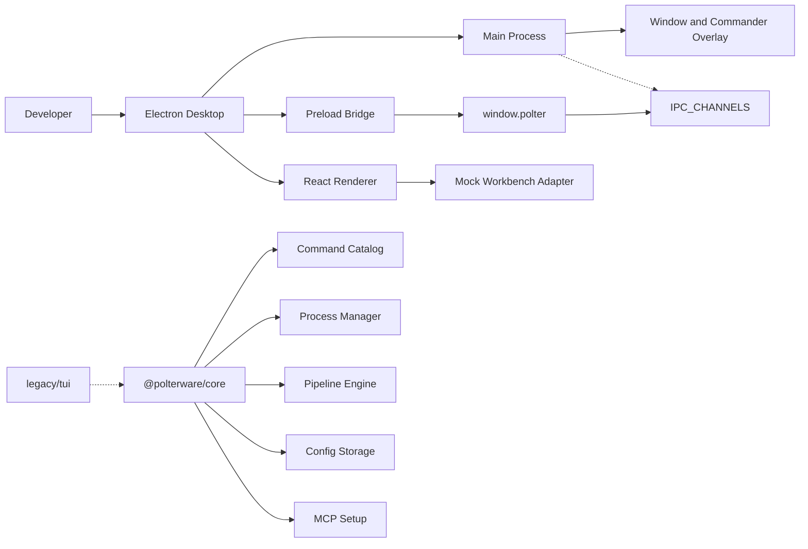

# Polter

Polter is a desktop-first command workbench for inspecting, composing, and supervising developer workflows. The current repository is a `pnpm` + Turborepo monorepo with an Electron desktop app in `apps/desktop` and shared non-visual TypeScript services in `packages/core`.

The product direction is a serious operational surface for commands, pipelines, processes, project configuration, MCP setup, scripts, and local workspace automation. The current Electron renderer is intentionally UI-only and mock-first: it demonstrates the desktop experience without running real backend, IPC, process, MCP, script, or declarative apply operations from the renderer.

## Problem

Developer operations often spread across shell history, package scripts, GitHub CLI, Vercel CLI, Supabase CLI, local process managers, MCP configuration, and one-off project notes. Polter brings those operational primitives into one desktop workbench so a developer can inspect project state, stage commands, compose pipelines, view process-like activity, and keep automation surfaces explicit.

## Main Features

- Electron desktop app with a main window and a global Commander overlay.
- UI-only renderer workbench with mock data for Processes, Pipelines, Scripts, Infrastructure, Tool Status, MCP, Skill Setup, Project Config, Settings, and command feature views.
- Typed preload bridge exposed as `window.polter`.
- Explicit IPC channel catalog in `apps/desktop/src/shared/ipc.ts`.
- Shared command catalog for Supabase, GitHub CLI, Vercel CLI, Git, and package-manager commands.
- Shared process manager, pipeline engine, declarative planner, MCP installer, config storage, and desktop service helpers in `packages/core`.
- Project-level `.polter/config.json` support for tool metadata, child repositories, environment entries, and pipelines.
- Local global config through the `conf` package for global pipelines and saved desktop repositories.
- Electron Builder packaging configuration for unsigned macOS, Windows, and Linux artifacts.
- Archived Ink/Bun TUI under `legacy/tui` for historical reference only.

## Technology Stack

| Area | Technology |
| --- | --- |
| Workspace | `pnpm@10.33.0`, Turborepo |
| Desktop runtime | Electron, electron-vite, Electron Builder |
| Renderer | React 19, TypeScript, Vite, Tailwind CSS, shadcn/ui, Radix/Base UI-style primitives |
| UI utilities | lucide-react, cmdk, motion, sonner, Orama, dnd-kit, react-resizable-panels |
| Core services | TypeScript, Zod, execa, conf, eventemitter3, p-limit, p-retry, which |
| MCP support | `@modelcontextprotocol/sdk` plus local MCP installation helpers |
| Tests | Vitest, Testing Library React, jsdom |

## Architecture

Polter is split into three active layers:

- `apps/desktop`: Electron main process, preload bridge, renderer shell, feature modules, UI components, tests, design contract, and packaging config.
- `packages/core`: shared non-visual services for commands, runners, processes, pipelines, declarative planning, config, MCP setup, IPC helpers, and desktop adapters.
- Root workspace: package orchestration, Turborepo tasks, workspace lockfile, docs, and project-level `.polter/config.json`.

The renderer is currently isolated from real runtime services. `apps/desktop/src/main/ipc.ts` registers public channels, but most handlers deliberately throw UI-only mode errors. The active renderer uses `apps/desktop/src/renderer/features/workbench/mock-workbench-adapter.ts` instead of calling real IPC or starting processes.



See [docs/architecture.md](docs/architecture.md) for the full technical architecture.

## Folder Structure

```text
.
├── apps/
│   └── desktop/              # Active Electron desktop app
├── packages/
│   └── core/                 # Shared non-visual TypeScript services
├── docs/                     # Product, architecture, setup, API, storage, and workflow docs
├── legacy/
│   └── tui/                  # Archived Ink/Bun TUI and CLI implementation
├── screenshots/              # Placeholder folder for future visual evidence
├── .github/workflows/        # Contains a stale legacy release workflow
├── .polter/config.json       # Project-level Polter config for this checkout
├── pnpm-workspace.yaml
├── turbo.json
└── package.json
```

## Prerequisites

- Node.js compatible with the Electron and TypeScript toolchain in this workspace.
- pnpm. The root manifest declares `pnpm@10.33.0`.
- Git for normal repository work.
- Optional CLIs for core command catalog workflows: Supabase CLI, GitHub CLI (`gh`), Vercel CLI, and a supported package manager (`npm`, `pnpm`, `yarn`, or `bun`).

## Installation

Install dependencies from the repository root:

```bash
pnpm install
```

The workspace packages are declared in `pnpm-workspace.yaml`:

```yaml
packages:
  - "apps/*"
  - "packages/*"
```

## Environment Configuration

Copy `.env.example` when local overrides are needed:

```bash
cp .env.example .env
```

Current documented variables:

| Variable | Purpose |
| --- | --- |
| `ELECTRON_RENDERER_URL` | Development renderer URL consumed by Electron when a Vite renderer server is active. |
| `POLTER_LOG_FORMAT` | Core diagnostic log format. Supported values are inferred from code as `text` or `json`. |
| `POLTER_LOG_LEVEL` | Core diagnostic log level. |
| `POLTER_DEBUG` | Enables debug mode when set to `1` or `true`. |
| `EDITOR` | Preferred editor for config/edit flows. |
| `VISUAL` | Preferred visual editor. Takes precedence over `EDITOR`. |

No required production secrets were identified in the current active workspace.

## Running Locally

The root development script delegates to Turborepo and filters the desktop package:

```bash
pnpm dev
```

The desktop package script runs:

```bash
electron-vite dev
```

Agent sessions in this repository must not execute development, preview, build, or distribution commands. When runtime verification is needed, Erick should run the relevant command locally.

## Available Scripts

Root scripts:

| Script | What it does |
| --- | --- |
| `pnpm dev` | Runs `turbo run dev --filter=@polterware/desktop`. |
| `pnpm build` | Runs `turbo run build`. |
| `pnpm preview` | Runs `turbo run preview --filter=@polterware/desktop`. |
| `pnpm dist` | Runs desktop distribution through Turbo. |
| `pnpm dist:mac` | Builds a macOS desktop package target. |
| `pnpm dist:win` | Builds a Windows desktop package target. |
| `pnpm dist:linux` | Builds a Linux desktop package target. |
| `pnpm dist:all` | Builds all configured desktop package targets. |
| `pnpm design:lint` | Runs the desktop `DESIGN.md` lint task. |
| `pnpm deps:electron` | Prints the Electron dependency version from the desktop package. |
| `pnpm typecheck` | Runs package type-checking through Turbo. |
| `pnpm test` | Runs package tests through Turbo. |

Desktop package scripts are defined in `apps/desktop/package.json`. Core package scripts are defined in `packages/core/package.json`.

## Tests

Run all active workspace tests:

```bash
pnpm test
```

Run type-checking:

```bash
pnpm typecheck
```

The current test suite includes:

- Electron main-process tests for IPC registration and global shortcuts.
- Preload bridge tests for channel routing and Commander focus events.
- Renderer tests for root surface selection, navigation catalogs, mock workbench behavior, scripts, pipelines, processes, and Commander search.
- Core tests for command metadata, config storage, execution helpers, process manager behavior, IPC protocol, package manager detection, YAML writer, pins, suggested args, and error modeling.
- Legacy TUI tests under `legacy/tui`, retained with archived code.

## Build

Build the workspace:

```bash
pnpm build
```

The desktop build uses `electron-vite` and writes:

- Main process output to `apps/desktop/out/main`.
- Preload output to `apps/desktop/out/preload`.
- Renderer output to `apps/desktop/out/renderer`.

## Packaging And Deployment

Polter is packaged as an Electron desktop app through Electron Builder:

```bash
pnpm dist
pnpm dist:mac
pnpm dist:win
pnpm dist:linux
pnpm dist:all
```

Current package targets from `apps/desktop/electron-builder.yml`:

- macOS `dmg`
- Windows `nsis` for `x64`
- Linux `AppImage`

Signing, notarization, publishing, auto-update, rollback, and production release channels were not identified in the current active codebase.

The existing `.github/workflows/release.yml` appears stale for the current monorepo because it uses Bun and root-level `src/index.tsx` / `src/mcp.ts` paths that do not exist in the active workspace layout.

## Usage Examples

Open the desktop app in development:

```bash
pnpm dev
```

Run static checks:

```bash
pnpm typecheck
pnpm test
pnpm design:lint
```

Inspect the configured Electron dependency version:

```bash
pnpm deps:electron
```

Example `.polter/config.json` shape from this repository:

```json
{
  "version": 1,
  "tools": {
    "supabase": {}
  },
  "pipelines": []
}
```

## Current Project Status

- Active product surface: Electron desktop app in `apps/desktop`.
- Active shared logic: TypeScript core package in `packages/core`.
- Renderer runtime state: UI-only and mock-first.
- Legacy TUI: archived transition code in `legacy/tui`.
- Packaging: local unsigned Electron Builder configuration exists.
- Deployment/release automation: not production-ready in the current active workspace.
- Database: no database, ORM, migrations, or seeds are active.
- HTTP API: not present.

## Roadmap And Next Steps

Useful next steps based on the current codebase:

- Replace UI-only IPC handlers with carefully scoped real handlers when runtime integration is approved.
- Decide whether `.github/workflows/release.yml` should be removed, rewritten for Electron packaging, or kept only for legacy reference.
- Add durable local storage if the command registry, audit history, machine registry, or process history moves beyond config files and memory.
- Add signing, notarization, release channel, and rollback policy before public distribution.
- Add screenshots to `screenshots/` and reference them from this README when the UI is ready for portfolio presentation.

## License

No root license file or root `license` field was identified in the active workspace. The archived `legacy/tui` package declares MIT and contains its own `legacy/tui/LICENSE`; that license should not be assumed to cover the entire current monorepo without confirmation.
