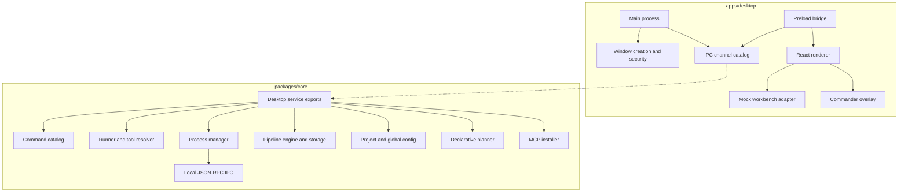

# Technical Architecture

## Architecture Overview

Polter is a TypeScript monorepo with an Electron desktop app and a shared core package. The active architecture is desktop-first, with runtime-sensitive logic kept out of the React renderer.

Current implementation status:

- `apps/desktop` is the active Electron product.
- `packages/core` is the active shared non-visual package.
- `legacy/tui` is archived transition code.
- The renderer is UI-only and mock-first.
- Real bridge and core services exist as contracts and helpers, but most desktop IPC handlers are intentionally disconnected in UI-only mode.

## Main Layers

### Workspace Layer

Root files:

- `package.json` declares the private workspace and root scripts.
- `pnpm-workspace.yaml` includes `apps/*` and `packages/*`.
- `turbo.json` defines `dev`, `build`, `preview`, `dist*`, `typecheck`, `test`, `design:lint`, and `deps:electron` tasks.
- `.env.example` documents renderer, logging, debug, and editor variables.

### Electron Main Layer

Files:

- `apps/desktop/src/main/index.ts`
- `apps/desktop/src/main/window.ts`
- `apps/desktop/src/main/ipc.ts`
- `apps/desktop/src/main/global-shortcuts.ts`

Responsibilities:

- Bootstrap Electron.
- Configure main-process logging with `electron-log`.
- Create the main window and Commander overlay window.
- Configure secure web preferences.
- Register the global Commander shortcut.
- Register UI-only IPC handlers.
- Deny unexpected permissions, constrain navigation, and open allowed external links through the OS shell.

### Preload And IPC Contract Layer

Files:

- `apps/desktop/src/preload/index.ts`
- `apps/desktop/src/preload/bridge.ts`
- `apps/desktop/src/shared/ipc.ts`

Responsibilities:

- Expose `window.polter` through `contextBridge`.
- Keep Electron and Node APIs out of renderer code.
- Route calls through named IPC channels.
- Define channel names in one explicit shared catalog.

### Renderer Layer

Files:

- `apps/desktop/src/renderer/main.tsx`
- `apps/desktop/src/renderer/root.tsx`
- `apps/desktop/src/renderer/App.tsx`
- `apps/desktop/src/renderer/features/**`
- `apps/desktop/src/renderer/components/ui/**`
- `apps/desktop/src/renderer/styles.css`
- `apps/desktop/src/renderer/shell.css`

Responsibilities:

- Render the normal app surface or Commander overlay surface.
- Compose feature views through `App.tsx`.
- Keep screen logic in feature folders.
- Use `createMockWorkbenchAdapter()` for current UI-only state.
- Use Sonner for routine feedback.
- Follow the design contract in `apps/desktop/DESIGN.md`.

### Core Package Layer

Files:

- `packages/core/src/index.ts`
- `packages/core/src/data/**`
- `packages/core/src/lib/**`
- `packages/core/src/pipeline/**`
- `packages/core/src/config/**`
- `packages/core/src/declarative/**`
- `packages/core/src/desktop/service.ts`

Responsibilities:

- Command catalog and feature grouping.
- CLI tool resolution and command execution helpers.
- Package-manager detection and command translation.
- Process management and output ring buffers.
- Local JSON-RPC IPC server and client for process operations.
- Pipeline execution and storage.
- Project and global config storage.
- Declarative `polter.yaml` parsing, planning, status, and apply helpers.
- MCP server installation and removal helpers.
- Desktop service adapter functions for future real desktop integration.

## Component Communication



The important current limitation is that the renderer does not call `window.polter` for real runtime data. It uses the mock adapter for product development. `apps/desktop/src/main/ipc.ts` registers the public surface but returns UI-only errors for most channels.

## Data Flow

### Current UI-Only Renderer Flow

```text
React view
  -> useWorkbench()
    -> createMockWorkbenchAdapter()
      -> in-memory mock commands, repositories, pipelines, scripts, config, MCP, and processes
        -> React state
```

No external commands are executed in this flow.

### Future Real Desktop Flow Supported By Existing Contracts

```text
React view
  -> window.polter.<domain>.<method>()
    -> Electron preload
      -> IPC channel from IPC_CHANNELS
        -> main-process handler
          -> @polterware/core desktop service
            -> command/process/pipeline/config/MCP/declarative helper
```

The contract shape exists, but full real handler wiring is not active.

### Core Process Flow

```text
startProcess()
  -> execa(command, args, shell: true, detached: true)
  -> process registry Map
  -> stdout/stderr ring buffers
  -> processEvents
  -> list/log/stop/remove helpers
```

The process manager is in memory. It is not backed by a database.

## Internal Dependencies

`apps/desktop` depends on `@polterware/core` through the workspace package. Electron Vite is configured with `resolve.preserveSymlinks: false` and excludes `@polterware/core` from dependency externalization in the main bundle so TypeScript source imports are bundled into `out/`.

`packages/core` has no dependency on `apps/desktop`.

`legacy/tui` contains copied or historical logic and should not be used as an active architecture dependency.

## External Dependencies

Important active runtime and development dependencies:

- Electron, electron-vite, Electron Builder.
- React, React DOM, TypeScript, Vite, Tailwind CSS.
- shadcn/ui style primitives, Radix/Base UI-related packages, lucide-react.
- `@orama/orama` for Commander search behavior.
- `motion` and `sonner` for renderer interactions and feedback.
- `execa`, `which`, `p-limit`, `p-retry`, `eventemitter3`, `conf`, `zod`, and `@modelcontextprotocol/sdk` in core.
- Vitest, jsdom, and Testing Library React for tests.

Optional external CLIs that Polter knows how to inspect or invoke through core helpers:

- Supabase CLI.
- GitHub CLI (`gh`).
- Vercel CLI.
- Git.
- npm, pnpm, yarn, or bun.

## Patterns Used

- Monorepo with package-level ownership.
- Electron main/preload/renderer separation.
- Context-isolated preload bridge.
- Explicit IPC channel constants.
- Feature-folder renderer architecture.
- UI-only adapter pattern for safe renderer iteration.
- Shared core service exports for non-visual logic.
- Zod validation at external boundaries.
- In-memory process registry with ring-buffered output.
- Project config plus global local config instead of a database.

## Separation Of Responsibilities

| Area | Owner |
| --- | --- |
| Desktop windows and Electron permissions | `apps/desktop/src/main` |
| Renderer bridge API | `apps/desktop/src/preload/bridge.ts` |
| IPC channel names | `apps/desktop/src/shared/ipc.ts` |
| UI composition | `apps/desktop/src/renderer/App.tsx` |
| Feature UI and hooks | `apps/desktop/src/renderer/features/<feature>` |
| Shared UI primitives | `apps/desktop/src/renderer/components/ui` |
| Visual contract | `apps/desktop/DESIGN.md` |
| Command catalog and tool resolution | `packages/core/src/data`, `packages/core/src/lib/toolResolver.ts` |
| Process management | `packages/core/src/lib/processManager.ts` |
| Pipelines | `packages/core/src/pipeline` |
| Config storage | `packages/core/src/config` |
| Declarative planning | `packages/core/src/declarative` |
| MCP setup | `packages/core/src/lib/mcpInstaller.ts` |

## Extension Points

- Add renderer features under `apps/desktop/src/renderer/features/<feature>`.
- Add shared UI primitives under `apps/desktop/src/renderer/components/ui`.
- Add or modify public bridge methods in `apps/desktop/src/preload/bridge.ts`.
- Add matching channels in `apps/desktop/src/shared/ipc.ts`.
- Wire real main handlers in `apps/desktop/src/main/ipc.ts` when UI-only mode ends.
- Add desktop service functions in `packages/core/src/desktop/service.ts`.
- Add core command definitions under `packages/core/src/data/commands`.
- Add pipeline or declarative behavior under `packages/core/src/pipeline` and `packages/core/src/declarative`.

## Current Architectural Limitations

- The active renderer is mock-first and does not use real runtime IPC for most features.
- Main-process IPC handlers return deliberate UI-only errors except Commander window controls.
- There is no durable database for history, audit, command registry, machine registry, or process logs.
- The process registry is in memory and disappears when the process exits.
- Declarative YAML parsing is intentionally simple and does not use a full YAML library.
- The stale GitHub release workflow does not match the current workspace layout.
- No signing, notarization, publishing, auto-update, or rollback architecture was identified.
