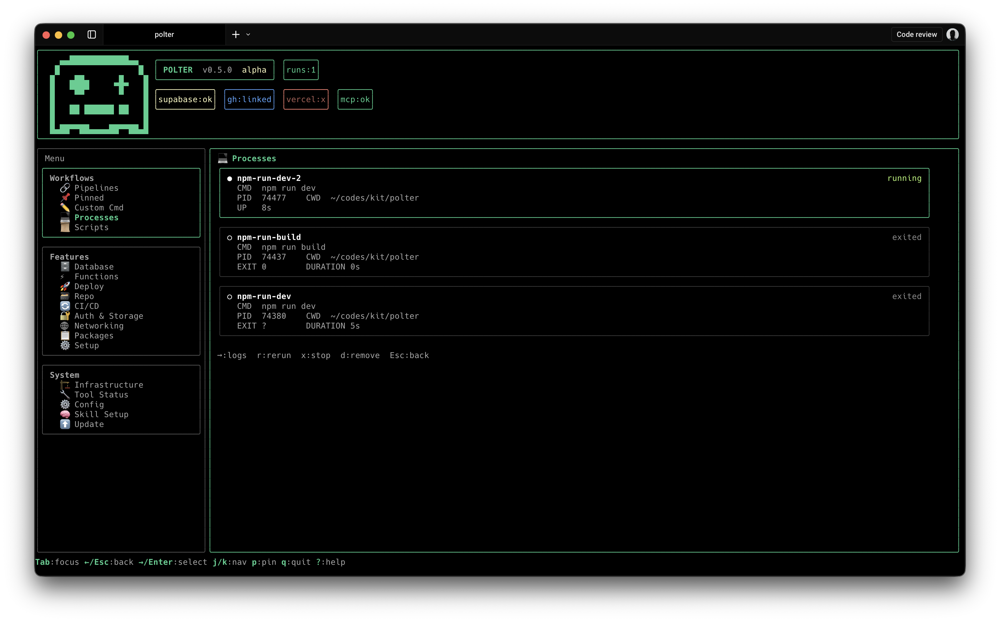

# @polterware/polter



[](https://opensource.org/licenses/MIT)

An infrastructure orchestrator CLI for managing dev processes, pipelines, CLI commands (Supabase, GitHub, Vercel, Git), and packages from one unified interface.

Polter replaces the need to juggle multiple CLIs. Browse a tabbed command board, chain steps into reusable pipelines, manage background processes, and apply declarative project configuration — all from a single TUI.

## Features

- **Multi-Tool Command Board**: Browse and run commands across Supabase, GitHub (`gh`), Vercel, Git, and your package manager from one tabbed interface
- **Pipelines**: Chain multiple commands into reusable, sequential workflows with progress tracking
- **Process Management**: Start, monitor, and control background dev servers and scripts
- **Declarative Configuration**: Define desired project state in `polter.yaml` and apply it with `polter plan` / `polter apply`
- **Interactive Arg Builder**: Guided flow for command + subcommand + extra args with suggested picks and flag selection
- **Pinned Commands and Runs**: Toggle base command pins with `→` and pin exact runs after success for one-click reuse
- **Package Manager Detection**: Auto-detects npm/pnpm/yarn/bun from lockfiles and translates commands between managers
- **MCP Server**: Expose Polter as an MCP server for AI tool integration (Claude Code, Cursor, etc.)
- **Built-in Self-Update**: Update Polter from inside the TUI or by re-running the install script
- **TypeScript-based CLI**: Strongly typed internal implementation with React + Ink TUI

---

## Installation

```bash
curl -fsSL https://raw.githubusercontent.com/polterware/polter/main/install.sh | bash
```

Downloads pre-built binaries (`polter` and `polter-mcp`) to `~/.polter/bin/`. Supports macOS (Apple Silicon + Intel) and Linux (arm64 + x64). No Node.js or other runtime required — Polter ships as a standalone binary powered by Bun.

### Update

Re-run the install script to update to the latest version:

```bash
curl -fsSL https://raw.githubusercontent.com/polterware/polter/main/install.sh | bash
```

You can also update from inside Polter via **Actions > Update Polter**.

### Uninstall

Remove Polter binaries and clean up:

```bash
polter uninstall
```

Or run the uninstall script directly:

```bash
curl -fsSL https://raw.githubusercontent.com/polterware/polter/main/uninstall.sh | bash
```

This removes `polter` and `polter-mcp` from `~/.polter/bin/`. Remember to remove the PATH entry from your shell profile afterwards.

---

## Requirements

No runtime dependencies — Polter ships as a standalone binary.

CLI tools are optional. Polter detects which ones are installed and shows their status on the Tool Status screen:

- **Supabase CLI** — [Install guide](https://supabase.com/docs/guides/cli)
- **GitHub CLI (`gh`)** — [Install guide](https://cli.github.com/)
- **Vercel CLI** — [Install guide](https://vercel.com/docs/cli)
- **Package manager** — auto-detected from your lock file (npm, pnpm, yarn, or bun)

Check your environment:

```bash
supabase --version
gh --version
vercel --version
```

---

## Quick Reference

### Execution Model

Polter resolves the appropriate CLI tool and executes commands as:

```bash
<tool> <command> <extra-args> <flags>
```

where `<tool>` is one of `supabase`, `gh`, `vercel`, `git`, or your package manager.

### Typical Flow

1. Choose a command from the unified board
2. Optionally pin/unpin with `→`
3. Choose suggested args or type custom extra args
4. Pick optional global flags
5. Confirm and execute

---

## Command Categories

Commands are organized into 9 feature groups in the TUI. Each group pulls from one or more CLI tools.

| Group | Tools | Representative commands |
| --- | --- | --- |
| **Database** | Supabase | `supabase db pull`, `supabase migration list`, `supabase seed`, `supabase inspect` |
| **Functions** | Supabase | `supabase functions serve`, `supabase functions deploy`, `supabase functions delete` |
| **Deploy** | Vercel, Git, Supabase | `vercel deploy --prod`, `vercel promote`, `vercel rollback`, `git push` |
| **Repo** | Git, GitHub | `git status`, `git commit`, `gh pr create`, `gh issue list`, `gh release create` |
| **CI/CD** | GitHub, Vercel | `gh workflow run`, `gh run view`, `vercel env pull`, `vercel env add` |
| **Auth & Storage** | Supabase | `supabase storage`, `supabase secrets`, `supabase sso` |
| **Networking** | Supabase, Vercel | `supabase domains`, `supabase ssl-enforcement`, `vercel domains add` |
| **Packages** | npm/pnpm/yarn/bun | `pkg install`, `pkg add`, `pkg audit`, `pkg publish`, `pkg version patch` |
| **Setup** | All | `supabase init`, `supabase link`, `vercel login`, `gh auth login` |

The board currently exposes **107 commands** across 5 CLI tools. Use the TUI tabs to browse a specific group or search across all of them.

---

## Flags

Flags are tool-specific. When you select a command, the interactive flag picker shows the available flags for that tool (e.g. `--debug` for Supabase, `--force` for Vercel, `--web` for GitHub CLI). You can also type custom flags in the extra-args input.

---

## Pinned Commands

Polter supports two pinned sections at the top of the main menu:

- `Pinned Runs` for exact commands like `db pull --debug`
- `Pinned Commands` for base commands like `db` or `start`

The main menu and the suggested-args screen group related options into boxed sections so pinned items, command groups, and actions stay visually separated.

Use `→` on a selected base command to pin or unpin it.
Use `→` on the suggested subcommand screen to pin exact runs like `db pull` before executing.
After a successful execution, Polter can also pin that exact command into `Pinned Runs`.

Pins are persisted locally using OS-level app config storage.

---

## Usage Examples

### Run a pipeline

```bash
polter pipeline run deploy-staging
```

Executes each step of the `deploy-staging` pipeline in sequence, showing progress as it goes.

### Deploy to Vercel

Interactive path:

1. **Deploy** tab
2. Command: `vercel deploy --prod`
3. Confirm and execute

Executed command:

```bash
vercel deploy --prod
```

### Create a GitHub PR

Interactive path:

1. **Repo** tab
2. Command: `gh pr create`
3. Extra args: `--fill`

Executed command:

```bash
gh pr create --fill
```

### Install a dependency

Interactive path:

1. **Packages** tab
2. Command: `pkg add`
3. Extra args: `zod`

Executed command (resolved for your package manager):

```bash
npm install zod        # npm
pnpm add zod           # pnpm
yarn add zod           # yarn
bun add zod            # bun
```

---

## Troubleshooting

### CLI tool not found

If a tool (Supabase, `gh`, Vercel) is not installed, its commands will still appear in the board but will fail at execution. Open the **Tool Status** screen to see which tools are detected and linked.

Fix:

1. Install the missing CLI (see [Requirements](#requirements))
2. Restart your terminal
3. Re-open Polter — the Tool Status screen should show a green check

### Command exits with non-zero code

Polter forwards execution to the underlying CLI tool. Check the tool's own documentation for the specific error. For Supabase commands, try adding `--debug`; for GitHub CLI, try `--verbose`.

### Pinned commands are missing

Pins are managed directly in the board. Select a base command and press `→` to pin it, or pin an exact run after a successful execution.

### Interactive prompt did not open correctly

Ensure you are running in a terminal that supports interactive TTY prompts.

---

## Security Notes

- Polter executes local shell commands through your installed CLI tools (Supabase, GitHub, Vercel, Git, package manager).
- Keep tokens and credentials out of shared shells and CI logs.
- Prefer short-lived tokens and least-privileged project access.

---

## Contributing

1. Fork the repository
2. Create a feature branch
3. Commit changes with clear messages
4. Open a pull request

Repository:

- [polterware/polter](https://github.com/polterware/polter)

---

## License

MIT License - see the [LICENSE](LICENSE) file for details.

## Author

[Polterware](https://www.polterware.com)
